## More on moving average (MA) model using mean reversion strategy

In this section, we try different **buy functions**. 

Recall the naive mean reversion MA model buys one share when current price is lower than the moving average, and sells one share when current price is higher than the moving average. Mathematically, this buy function is the sign function $sgn(x)=1$ for $x>0$, $sgn(x)=-1$ for $x<0$, and $sgn(x)=0$ for $x=0$. Below is the naive buy function plotted on a graph (left), and the corresponding trade history (right) by applying EMA onto Google's share price. 

  
  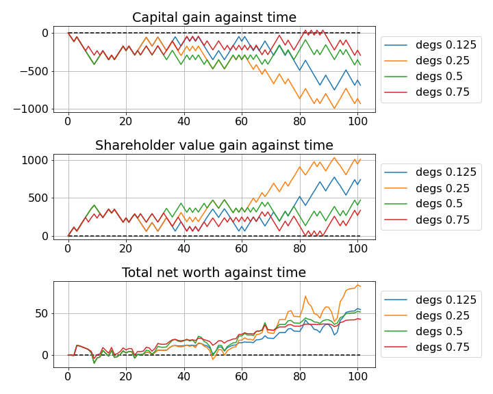

Instead of a sign function, what about a linear function? The figure below shows the graph of $y=x$ (left), and the corresponding trade history (right) using this buy function. 

  
  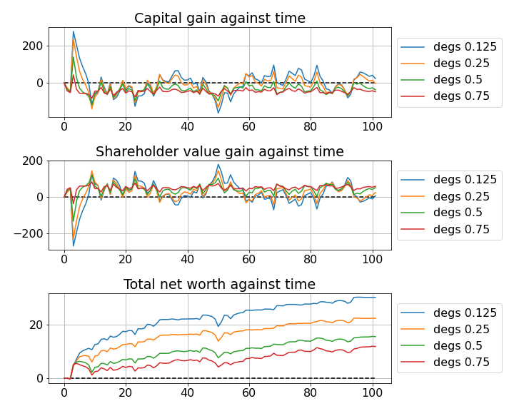

Similarly, for a logarithmic function $f(x) = \ln(1+x)$ for $x \geq 0$, and $f(x) = -\ln(1-x)$ for $x<0$, 

  
  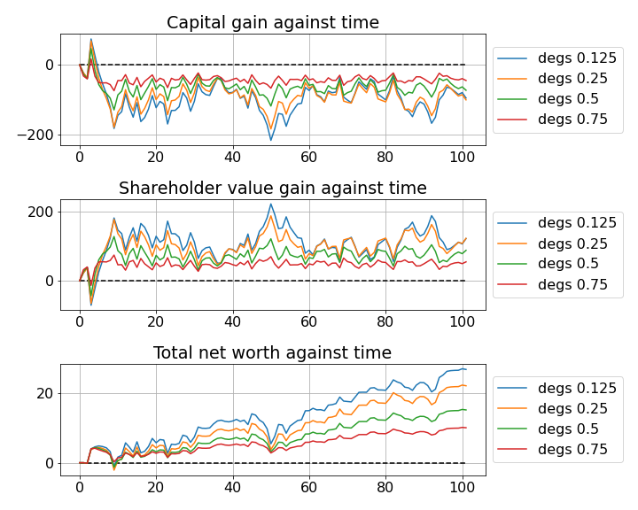

arctan $f(x)=\arctan(x)$, 

  
  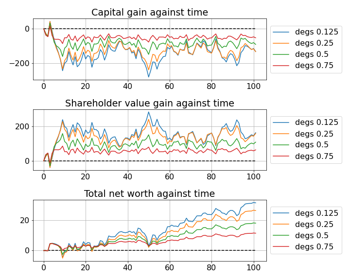

square root $f(x)=\sqrt{x}$ for $x \geq 0$, and $f(x)=-\sqrt{x}$ for $x<0$, 

  
  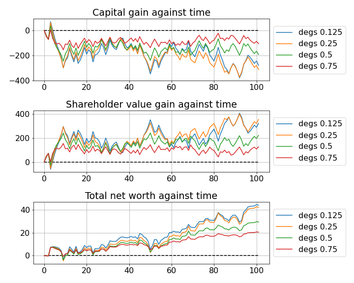

and just for fun, an exponential function $f(x) = e^x-1$ for $x \geq 0$, and $f(x) = 1-e^{-x}$ for $x<0$. 

  
  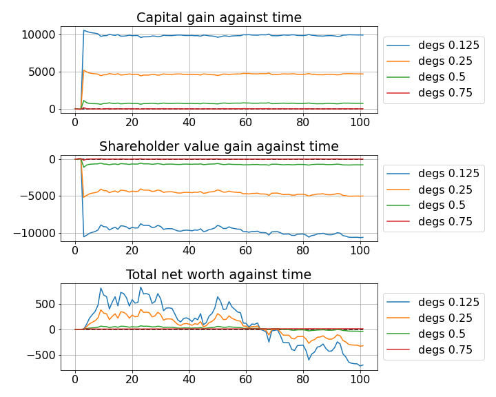

Since we can always scale the buy function by a constant factor, we are not particularly interested in the flat value of profit/loss, but rather the relative *dips* and *dunks* of it. What metric should we use to evaluate performance? Well, the best machine trades the *least* to gain the most profit. In other words, I would like to buy and sell as little shares as possible to maximise gain. Mathematically, the metric 
$$\text{profit per share traded (PPST)} =\frac{\text{net worth at the end}}{\text{total no. of shares bought and sold all throughout}}$$
is used. 

  As far as I know, this metric is not used in any literature. I apologise beforehand in case 1) there is a better metric to use and I missed it, or arguably worse, 2) this metric <b>is</b> used, but with a different name.

It can actually be shown that PPST is invariant under positive scalar multiplication to the buy function, ie. PPST remains the same when we multiply the buy function by a positive constant. The proof is not important to our cause and will be skipped. *Just believe me.*

The figures below plot the PPST against the degree of weighting decrease for different companies with varying buy functions. As usual, for all simulations, closing prices of the past 16 days are given (to compute the exponential moving average), and the machine trades once per day for 101 days. Circled is the point with highest PPST. 

  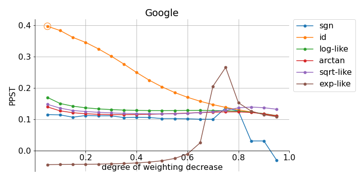
  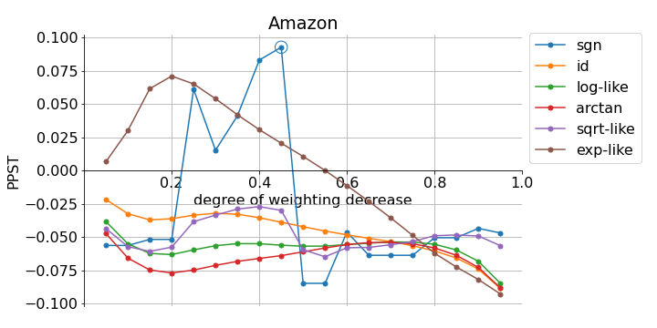
  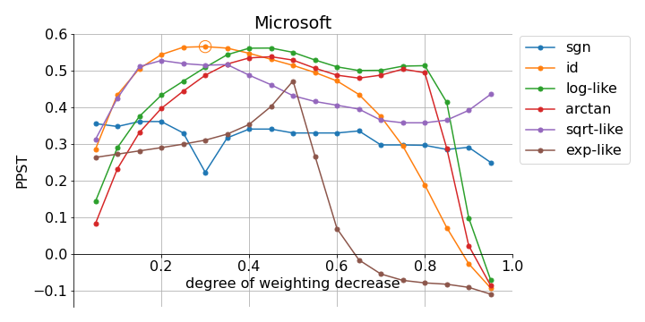
  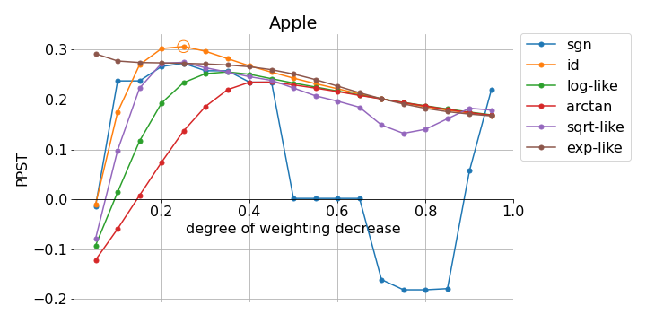

Three features stand out immediately:
1. The identity buy function (id) performs well. In fact, id scores the highest PPST with the right degree of weighting decrease inside the interval $[0.05, 0.3]$.
2. 
    a. The sign buy function (sgn) and exponential function (exp-like) are the most inconsistent as degree of weighting varied. 

    b. Logarithmic (log-like), arctan (arctan), and square root (sqrt-like) functions behave somewhat consistently as degree of weighting varied. They are also quite similar to each other. This is expected as the functions themselves are quite similar to each other. 
3. Things are ***weird*** with Amazon. 

It sounds absurd, but let's difference Amazon's corresponding time series again. Below shows the second difference time series (left) and the PSST against the degree of weighting decrease with varying buy functions (right). 

  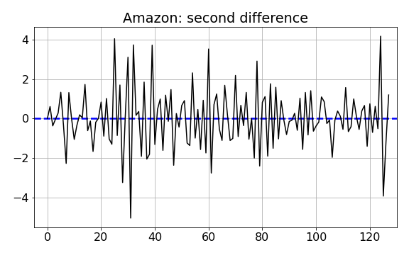
  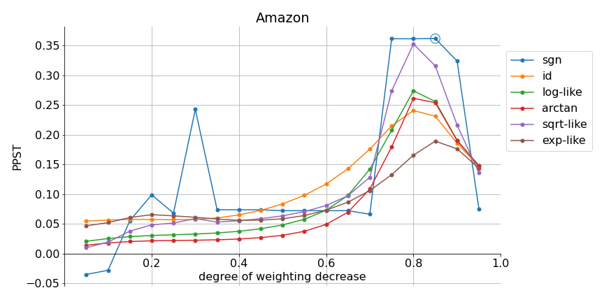

Now it makes more sense. 

Takeaways for this section on MA model using mean reversion: 
1. The metric PPST is introduced to evaluate the performance of a trading strategy. 
2. Taking second difference of a time series might make it more stationary. 
3. Although the identity buy function works quite well, it never hurts to try different buy functions, and with varying degrees of weighting decrease too. 