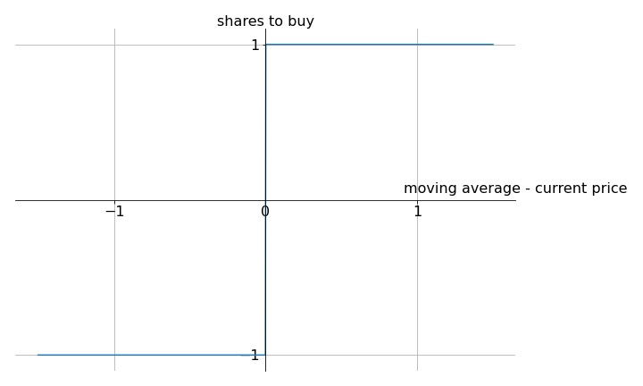
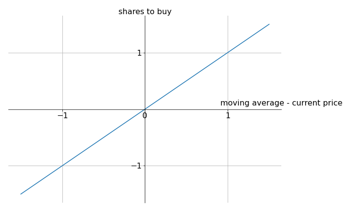

## More on moving average (MA) model using mean reversion strategy

The naive mean reversion MA model buys one share when current price is lower than the moving average, and sells one share when current price is higher than the moving average. Mathematically, this **buy function** returns 1 when moving average $-$ current price $>0$, returns -1 when moving average $-$ current price $<0$, and trivially returns 0 when moving average $-$ current price $=0$. Below is the naive buy function plotted on a graph. 

  

Let's see if we can do better. What about a linear function? The figure below shows the graph of $y=x$ (left), and the corresponding trading history (right) using this buy function. This time, we extend the trading days from 51 to 101. You'll see why. 

  
  

Tl;dr, the reason why there is a loss at the end is because moving average is delayed and cannot catch up with the trend, so there is a strong disparity between current price and moving average. See more back in the [main markdown file](README.md). 
