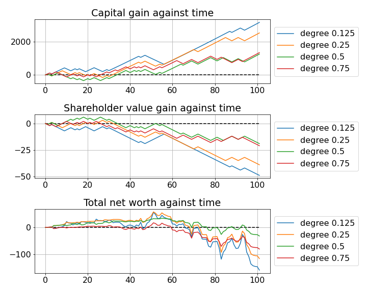
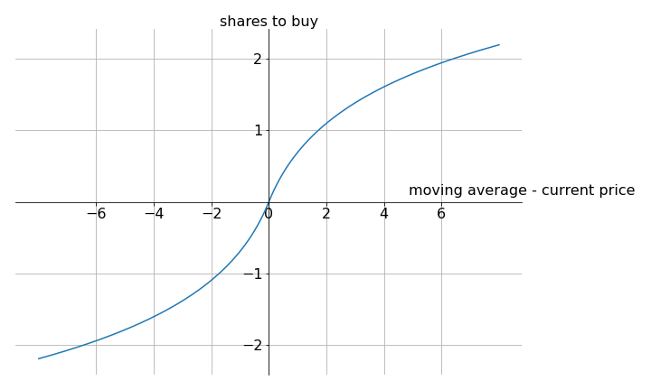
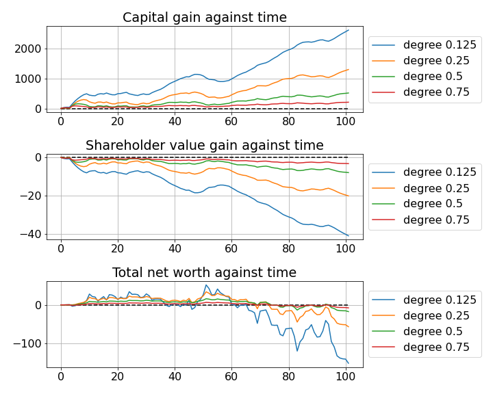
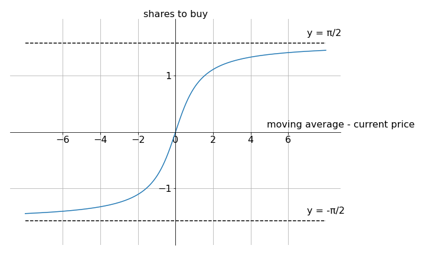
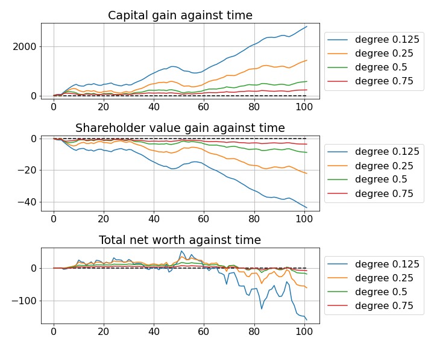
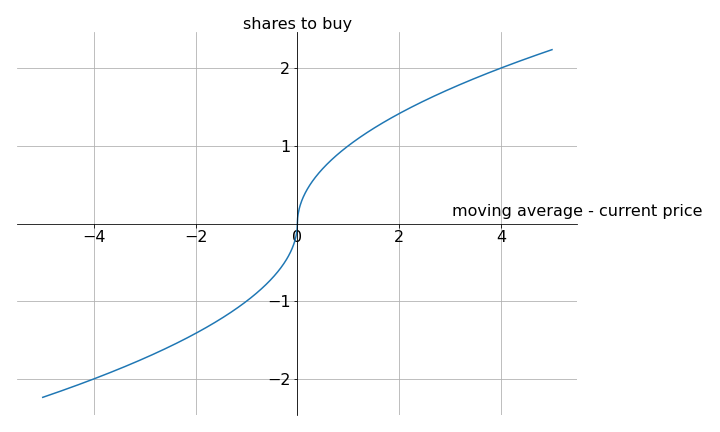
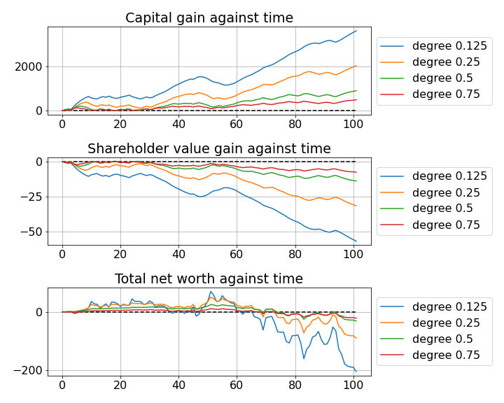
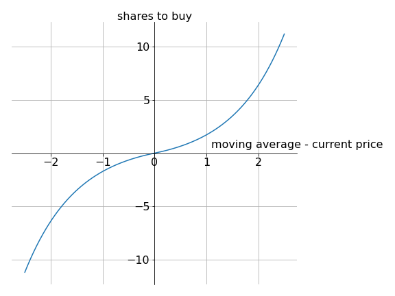
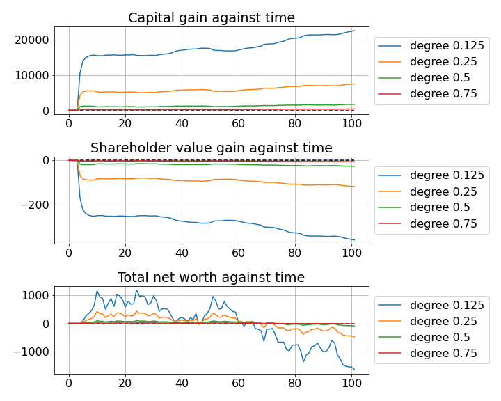

## More on moving average (MA) model using mean reversion strategy

The naive mean reversion MA model buys one share when current price is lower than the moving average, and sells one share when current price is higher than the moving average. Mathematically, this **buy function** returns 1 when moving average $-$ current price $>0$, returns -1 when moving average $-$ current price $<0$, and trivially returns 0 when moving average $-$ current price $=0$. Below is the naive buy function (mathematically called a sign function) plotted on a graph (left), and the corresponding trade history (right). This time, we extend the trading days from 51 to 101. You'll see why. 

  
  

Tl;dr, the reason why there is a loss at the end is because moving average is delayed and cannot catch up with the trend, so there is a strong disparity between current price and moving average. See more back in [main](README.md). 

Let's see if we can do better. What about a linear function? The figure below shows the graph of $y=x$ (left), and the corresponding trade history (right) using this buy function. 

  
  

Similarly, for a logarithmic function, 

  
  

arctan,

  
  

square root,

  
  

and just for fun, an exponential function. 

  
  

Since we can always scale the buy function by a constant factor, we are not particularly interested in the flat value of profit/loss, but rather the relative dips and dunks of it. For the sensible buy functions (linear, logarithmic, arctan, square root), there tends to be less fluctuation in all 3 categories: capital gain, shareholder gain, and net worth, compared to the naive model when the degree of weighting decrease is higher. However, disappointingly, the sensible buy functions are all pretty much indistinguishable from each other in terms of performance. 

The exponential function represents an extremely confident gambler. One who buys/sells more shares when the current price deviates more from the moving average. One that does not capitalise on small fluctuations but instead bets heavily on large discrepancy. Unrealistic for a human (since human hates taking too much risk), but despite that, its performance stands out the most. It is the **only** buy function which throughout its trading course, at one point (around $t=25$) makes nearly as much profit as its loss towards the end. And this observation holds true for all degrees of weighting decrease. 

To be honest, the exponential function started off as an unrealistic counter-example to illustrate how humans trade but might have turned out to be... not exactly successful, but definitely an interesting and plausible buy function worth looking into. Some things you never know until you try huh. 
