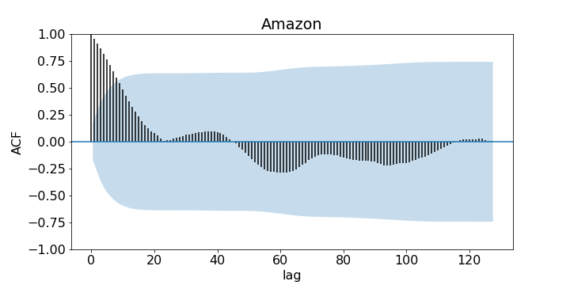
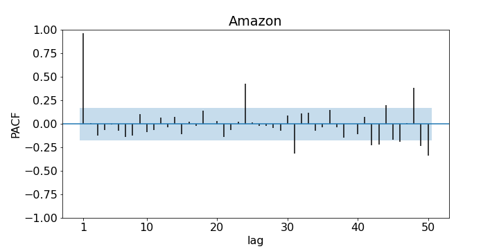
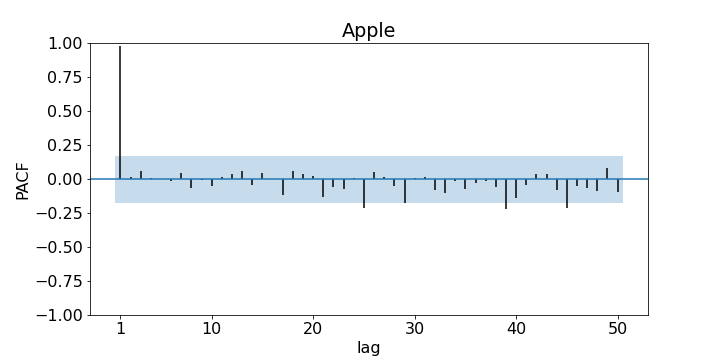

# Algorithmic trading

## Introduction

***Algorithmic trading*** is the act of trading on the stock market using automated computer algorithms. It offers many advantages as opposed to manual trading: 
- no (less) human error,
- consistent,
- continuous monitoring and trading,
- sensitive, 
</a>
and more. As more forms of trading like cryptocurrency surface, trading is becoming more and more accessible to the common person. There is a fast-growing market for people who want to invest but do not have the time to learn about the technicalities to it, and so the idea of selling trading bots is conceived. 

In this project, different trading strategies are investigated *(well, lightly, since I'm a maths student after all and this project is fuelled by passion and interest, rather than the heavy expectation of an expert)* and a trading bot is written in Python. *(Again, since I'm very much a mathematician,)* Detailed analysis is performed on said trading bot, and we compare it to other existing trading bots on the market. The final goal from then is to put our trading bot to test in the stock market. With **real money**. In **real time**. 

## Time series analysis

Fundamentally, the stock market functions is a ***time series***. Although the stock market is notorious for its complexity and its near impossibility to predict, time series analysis still serves as a **powerful** tool for stock market forecasting. Much of the prior knowledge of what I am about to is covered extensively in *"Analysis of Financial Time Series"* by Tsay RS. Albeit old, this book is powerful introductory material to financial time series. 

For this part, the daily closing prices of Google, Amazon, Microsoft, and Apple ranging from 01/07/2019 to 31/12/2019 are investigated. This date range is chosen so the impact of COVID-19 can be dismissed. We plot the autocorrelation function (ACF) against lag for each corporations with a 95% confidence interval. 

  
  
  
  

We see that correlation is weaker as the lag horizon increases. More specifically, ACF drops below statistical significance (95% confidence) at around lag $l=10$ for all corporations. This is a good indication that AutoRegressive (AR) models are suitable for forecast. 

We now plot the partial autocorrelation function (PACF) against lag for each corporation with a 95% confidence interval. 

  
  
  
  

For all corporations, only the PACF for lag $l=1$ is statistically significant whereas the PACFs for lag $l>1$ are nearly statistically insignificant. This is a good indication that AR models of order 1 are suitable for forecast. However, as we are starting with an intuitive trading strategy, the mean reversion strategy, we shall explore the moving average (MA) model first, since it ties in much better with mean reversion strategy. 

## Mean reversion

***Mean reversion*** is a simple and intuitive trading strategy. The mean, and this can *mean* a lot of things (pun intended), of previous closing prices is computed and we compare it with the current price. Is the current price *lower* than the mean? Well maybe you should buy some shares before the price jumps back up. Is the current price *higher* than the mean? Well maybe you should sell some shares before the price falls. 

### Moving average (MA) model
There are two questions keen readers might pick up on after reading the description of MA strategy:
1. Mean is simply the mean, the average. How are there different types of mean?
2. Buy low, sell high; I get it, and we are using the mean as the standard for what is low and high. But what if the price never returns to the mean?

These are very good questions, and we should know the answer to them before designing any algorithms. 
1. The key lies in the **weights** of the mean. The *mean* we are familiar with is really the *arithmetic mean with uniform weights*. That's a mouthful. Essentially, the data points you are computing the mean for, might not be of equal importance. In the case of trading, perhaps recent closing prices are more important than older closing price from two years ago. We might want to give recent closing prices heavier **weights** when using a model. 
2. This is the pitfall of mean reversion. Mean reversion exploits the volatility of the stock market and naively assumes that no matter how much the prices jump up and down, it will return to its mean. We shall see later how this will become problematic. 

To employ the mean reversion strategy, we must use a model which can compute/estimate the mean. Here, we use a moving average (MA) model. There are two types of MA models: simple, and weighted. 

Simple MA models computes the unweighted average within a constant timeframe called order. So, a simple moving average model of order 5, denoted by SMA(5), computes for each day, the unweighted mean closing price for the past 5 days. As its name suggests, a weighted MA model computes the weighted average instead, usually putting heavier weights on more recent closing prices. For our purposes, the only weighted MA model we shall look at is the *exponential moving average* model, or EMA. 

Without going deeply into the maths *(as much as I want to)*, EMA places exponentially decreasing weights on previous closing prices. So, the closing price of each day into the past gradually gets applied less weight, meaning the closing price a few years ago will have very minimal influence on computing our mean. A constant is required to decide how quickly the weights of older closing prices decrease, and we call it the degree of weighting decrease. An exponential moving average model of degree of weighting decrease 0.5 is denoted by EMA(0.5). The degree of weighting decrease ranges from 0 to 1. The closer it is to 1, the quicker the weights of older closing prices decrease. 

We run a simulation to get an insight on how MA works with mean reversion strategy. We apply our model called MA_MR_naive onto the share prices of Google starting from 01/07/2019. More specifically, we start trading on 16/07/2019, but we give our MA models some time to "buffer" since past data are required to compute the moving average. We perform 51 trades, which is equivalent to saying we trade for 51 days. In each day, the simple/exponential mean is computed. If the closing price 
today is lower than the mean, then 1 share is bought. Likewise, if the closing price today is higher than the mean, then 1 share is sold. It is assumed that we have enough capital (so we can always buy shares) and enough shares (so we can always sell shares) at the start. 

Below is the result of SMA of different orders in application. Total net worth is the sum of the capital gain and shareholder gain value. 

  

Similarly, below is the result of EMA of different degrees of weighting decrease in application. 

  

We see that exponential moving averages tend to be smoother and simple moving averages tend to be more jagged. This, however, does not play a huge part in trading, as seen from the similar-ish results displayed above. 

The naive part of this model is that we only buy/sell 1 share at a time. Depending on how close we are to the mean, we should buy/sell different amount of shares. This is explored more in [more on moving average using mean reversion strategy](MA_MR.md). 

The graphs above, albeit pretty, paint a very different picture from reality though. Even though profits are made using mean reversion strategy with a moving average, things fall apart quickly if we allow the machine to run for another 50 days. Here, only the result using the EMA model are shown, but SMA model shows a similar result. 

  

*It's... pretty terrible to say the least*. Recall the pitfall of mean reversion, that it exploits price volatility and **expects** the price to return to its mean, so when we have a clear general trend, mean reversion does not perform well. Think of it this way: moving average lags behind the real trend. This model is susceptible to when mean is not constant. So, ironically, it is susceptible to the *moving average* of the real share price. Ha ha. 

Instead of an MA model, let's try an...

### Autoregressive (AR) model
