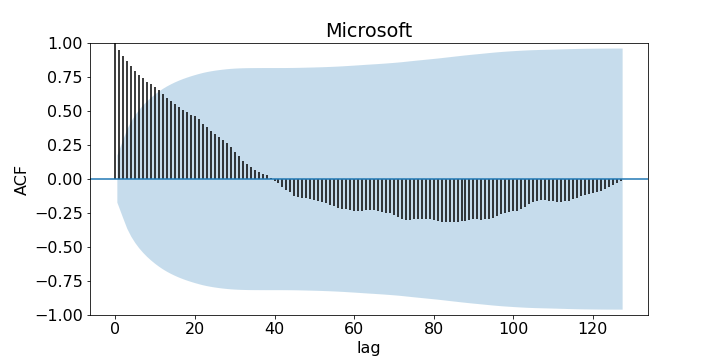

# Algorithmic trading

## Introduction

***Algorithmic trading*** is the act of trading on the stock market using automated computer algorithms. It offers many advantages as opposed to manual trading: 
- no (less) human error,
- consistent,
- continuous monitoring and trading,
- sensitive, 
</a>
and more. As more forms of trading like cryptocurrency surface, trading is becoming more and more accessible to the common person. There is a fast-growing market for people who want to invest but do not have the time to learn about the technicalities to it, and so the idea of selling trading bots is conceived. 

In this project, different trading strategies are investigated *(well, lightly, since I'm a maths student after all and this project is fuelled by passion and interest, rather than the heavy expectation of an expert)* and a trading bot is written in Python. *(Again, since I'm very much a mathematician,)* Detailed analysis is performed on said trading bot, and we compare it to other existing trading bots on the market. The final goal from then is to put our trading bot to test in the stock market. With **real money**. In **real time**. 

## Time series analysis

Fundamentally, the stock market functions is a ***time series***. Although the stock market is notorious for its complexity and its near impossibility to predict, time series analysis still serves as a **powerful** tool for stock market forecasting. Much of the prior knowledge of what I am about to is covered extensively in *"Analysis of Financial Time Series"* by Tsay RS. Albeit old, this book is powerful introductory material to financial time series. 

For this part, the daily closing prices of Google, Amazon, Microsoft, and Apple ranging from 01/07/2019 to 31/12/2019 are investigated. This date range is chosen so the impact of COVID-19 can be dismissed. We plot the autocorrelation function (ACF) against lag for each corporations with a 95% confidence interval. 

  
  
  
  

We see that correlation is weaker as the lag horizon increases. More specifically, ACF drops below statistical significance (95% confidence) at around lag $l=10$ for all corporations. This is a good indication that AutoRegressive (AR) models are suitable for forecast. 

We now plot the partial autocorrelation function (PACF) against lag for each corporation with a 95% confidence interval. 

For all corporations, only the PACF for lag $l=1$ is statistically significant whereas the PACFs for lag $l>1$ are nearly statistically insignificant. This is a good indication that AR models of order 1 are suitable for forecast. 
